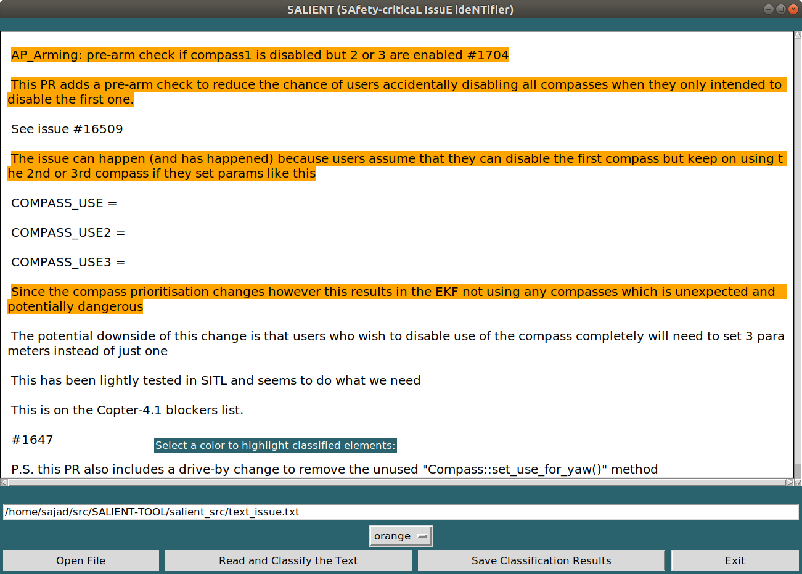

# Identifying Safety-Critical Concerns in Unmanned Aerial Vehicle (UAV) Software Platforms with SALIENT

SALIENT is a machine learning (ML)-enabled tool which analyzes individual sentences composing the issue reports of UAVs and automatically recognizes those describing a safety-related concern. The assessment of the classification performance of the tool on the issues of three popular open-source UAV-related projects demonstrates that SALIENT represents a viable solution to assist developers in timely identifying and triaging safety-critical UAV issues.

[add the video here]

## Setup

1. Clone this repository

`git clone https://github.com/spanichella/SALIENT-TOOL.git`

### Local Development Environment (With GUI)

2. Make sure you have all the Requirements

- Python 3.9
- [Docker](https://docs.docker.com/get-docker/)
- [Poetry](https://python-poetry.org/docs/#installation)  
- [tkinter](https://docs.python.org/3/library/tkinter.html)

```
apt-get update
sudo apt-get install tk # on macosx pip3 install tk
```

3. Install the requirements usint poetry:

```
poetry install
cat requirements.txt | xargs -I % sh -c 'poetry add "%"'
pip install -r requirements.txt
```

4. Install fasttext:

`pip install fasttext==0.9.1`

5. `cd salient_src`

6. Open the [GUI](#graphical-user-interface-gui):

`python salient_gui_tkinter.py`

7. Run the [CLI](#command-line-interface-cli):

`python Fasttext-Model-prediction-on-safety-unseen-data.py --infile config.json`

  <!-- (<https://realpython.com/dependency-management-python-poetry/>) then     - add it to your Home path (e.g., in Macos with "```export PATH="$HOME/.local/bin:$PATH"```")
    - check if all is fine from the command line, with  "```poetry --version```"
    - in case of issue try " ```curl -sSL https://install.python-poetry.org | python3 - \ & export PATH="$HOME/.local/bin:$PATH"  & poetry --version``` "
    - to update (or add) dependencies to poetry (assuming requirements.txt has been generated, e.g., by pypreqs): ```cat requirements.txt | xargs poetry add``` (If you do have version numbers you could modify this with ```cat requirements.txt | xargs -I % sh -c 'poetry add "%"'``` )
  <!-- - Install [XQuartz](https://www.xquartz.org/), relevant to run the SALIENT GUI in MacOsX, other version of the GUI are planned to support also Windows OS  (see [X11 for Windows and Mac](https://kb.thayer.dartmouth.edu/article/336-x11-for-windows-and-mac)) -->
<!-- with GUI:

5. Run XQuartz
  - ``` open -a XQuartz ```

6. Set your Mac (or Linux) IP address
  - ``` IP=$(/usr/sbin/ipconfig getifaddr en0) ```

7. Allow connections from Mac (or Linux) to XQuartz
  - ``` /opt/X11/bin/xhost + "$IP" ``` -->

<!-- 3. To run the SALIENT-TOOL GUI you need to run the following command on your (Mac on Linux machine) machine (**non interactive mode**):
  - ``` docker run -it -e DISPLAY="${IP}:0" -v /tmp/.X11-unix:/tmp/.X11-unix salient_tool ``` -->

<!-- 8. In case you want to run SALIENT-TOOL in an interactive way (this gives you access to both the SALIENT-TOOL GUI and the command line tool version):

- to run the SALIENT-TOOL GUI in an **"interative mode"**:
  - execute ``` docker run --rm -it -e DISPLAY=$DISPLAY -v /tmp/.X11-unix:/tmp/.X11-unix:rw salient_tool bash ```
  - then **execute the GUI** within the container
    - ``` cd salient_src ```
    - ``` python salient_gui_tkinter.py ```
  - then **execute the command line** within the container
    - ``` cd salient_src ```
    - ``` python Fasttext-Model-prediction-on-safety-unseen-data.py --infile config.json ``` -->

### Using Docker
<!-- 2) In case a container with the same name is already running and you want to remove it (stop container with):

- ```docker container ls```
- ```docker container stop $(docker container ls -aq)```
- ```docker system prune```
- ```docker container ls``` -->

2. Build and tag the docker image:

`docker build . -t salient_tool` # in macosx can require "sudo": sudo docker build . -t salient_tool

<!-- 4) Check that the image is among the available images with the docker images command:

- ``` sudo docker images ``` -->
3. Run the container and open bash:
<!-- without GUI: -->
`docker run -it salient_tool bash`

4. Start using the [CLI](#command-line-interface-cli):

```python Fasttext-Model-prediction-on-safety-unseen-data.py --infile config.json```

 (Optional) In case a container with the same name is already running and you want to remove it (i.e., stop container): 
```shell script
docker container ls
docker container stop $(docker container ls -aq)	
docker system prune
docker container ls
```

## Command Line Interface (CLI)

SALIENT provides the following interfaces:

1. ```python Fasttext-Model-prediction-on-safety-unseen-data.py --infile config.json```
[describe what it does]
[describe the parameters]

<!-- 2. [any remainig interfaces?] -->

## Graphical User Interface (GUI)

Users can access the GUI with the following command:`python salient_gui_tkinter.py`

[could be usefull to update the picture with marker (1,2,3,etc. on different parts to be explained)]

[describe the GUI here, what are different buttons and fileds for, and how it works]

## License

```{code-block} text
SALIENT tool for the automated identification of Safety Concerns Reported in UAV Software Platforms.
Copyright (C) 2022  Sebastiano Panichella

This program is free software: you can redistribute it and/or modify
it under the terms of the GNU General Public License as published by
the Free Software Foundation, either version 3 of the License, or
(at your option) any later version.

This program is distributed in the hope that it will be useful,
but WITHOUT ANY WARRANTY; without even the implied warranty of
MERCHANTABILITY or FITNESS FOR A PARTICULAR PURPOSE.  See the
GNU General Public License for more details.

You should have received a copy of the GNU General Public License
along with this program.  If not, see <https://www.gnu.org/licenses/>.
```

The software we developed is distributed under GNU GPL license. See the
[LICENSE.md](https://github.com/spanichella/SALIENT-TOOL/LICENSE.md) file.

## References

If you use this tool in your research, please cite the following paper(s):

- Andrea Di Sorbo, Fiorella Zampetti, Corrado A. Visaggio, Massimiliano Di Penta, and Sebastiano Panichella: Automated Identification and Qualitative Characterization of Safety Concerns Reported in UAV Software Platforms. Transactions on Software Engineering and Methodology. 2022.

```{code-block} bibtex
@article{UAV:2022,
  title={Automated Identification and Qualitative Characterization of Safety Concerns Reported in UAV Software Platforms},
  author={Andrea Di Sorbo and Fiorella Zampetti and  Corrado A. Visaggio  and Massimiliano Di Penta and Sebastiano Panichella},
  journal={Transactions on Software Engineering and Methodology},
  year={2022},
  publisher={Elsevier}
}
```

## Contacts

- **Dr. Sebastiano Panichella**
  - Zurich University of Applied Sciences (ZHAW), Switzerland - <panc@zhaw.ch>
- Sajad Khatiri
  - Zurich University of Applied Sciences (ZHAW), Switzerland - <mazr@zhaw.ch>
- Dr. Andrea Di Sorbo:
  - University of Sannio, Italy - <disorbo@unisannio.it>
